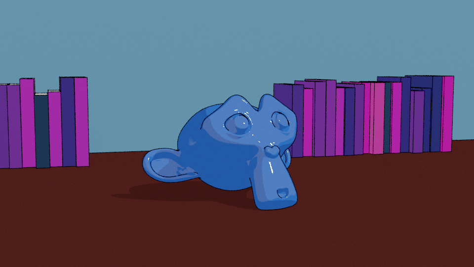
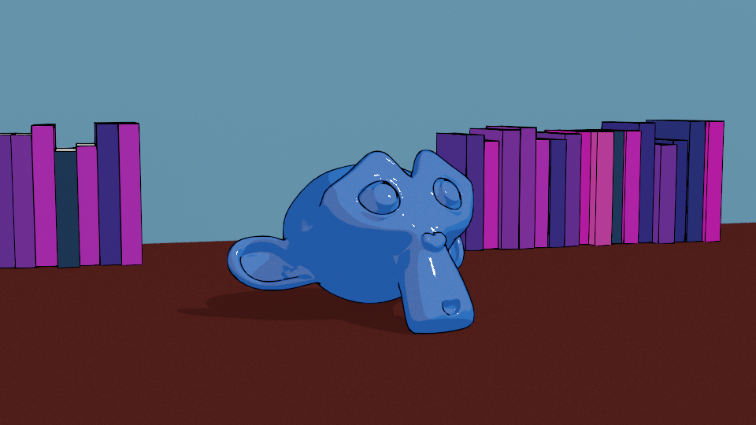
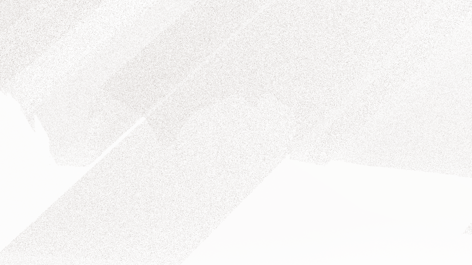
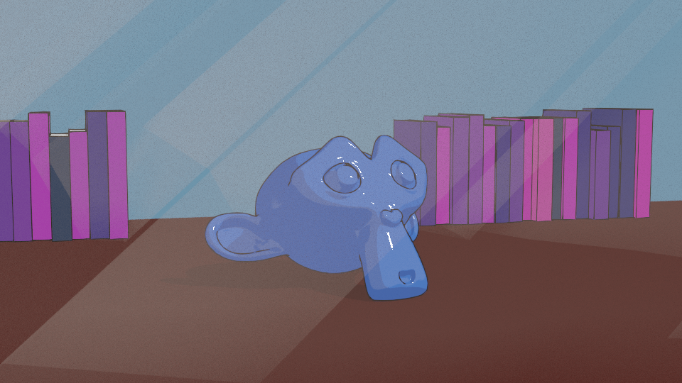
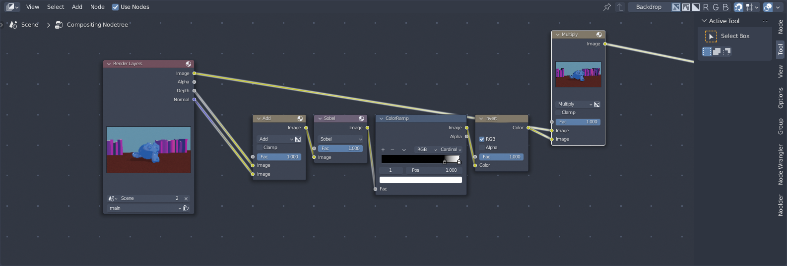

# Creating Line Art with Blender

*In this tutorial, we will be covering the different techniques of doing line art with Blender*

*~9 minute read*

# Directory

- [What is Lineart](#what_is_lineart)
- [Line Art with Geometry](#goem_line)
	- [How To](#geom_howto)
- [Line Art with Freestyle](#freestyle)
	- [How To](#freestyle_howto)
- [Line art with Grease Pencil](#grease)
	-[How To](#grease_howto)
		- [The Manual Way](#manual)
		- [The Fast Way](#fast)
	- [Overiding line art Per object or Collection](#override)
		- [View Layers](#view-layers)
- [Screen Space line art using a Sobel Filter, the Depth Pass and the normal pass](#sobel)
	- [How to](#sobel_howto)
- [Conclusion](#conclusion)

# What is line art

Line art, or outlines, are a staple of hand drawn art and stylized art in general. It's not just useful for creating the look of hand drawn work but it's useful for breaking up foreground and background elements. There are multiple ways of doing it with Blender each with their pros and cons.

# Line art with Geometry

One of the easiest forms of creating line art is creating a hull outline out of geometry. This method works well because it's quick and easy to setup, it works in cycles, eevee, it's visible in the viewport, and since it's just geometry it can be exported and used inside of other apps like Sketchfab or game engines like Godot, Unity or Unreal (Godot even has a function for creating these!). Even though it seems great there are some drawbacks

- Effectively doubles the polycount of your object since it's a duplication of it
- Only works with silhouettes, contours and edge marks aren't supported. This is why throughout this tutorial we'll be referring to this method as *Outlines* 
- As seen with the demo above, this method can easily clip into surfaces.

## How to:

To create a hull outline is quite simple, yet tedious. If you want to do the easy way and are a Blender user consider using this addon I made to facilitate creating them quickly [Blender Create Outlines](https://github.com/TehMerow/blender_create_outline_mesh)

1. Duplicate the object you want to have an outline. To organize better rename it by giving it a suffix of *-outline* or *.outline* so you don't get confused later on. (Tip: press `alt+D` to create a linked copy so whenever you edit the mesh the same changed will be apples to the outline)
2. With the outline object selected jump into *edit mode* and select all the faces by pressing `A`
3. Flip the normals of the selected faces with `alt+n>flip`. Make sure all the normals are facing the right direction by clicking on the *viewport overlays* drop down at the top right of the viewport and checking on *Face Orientation* if all the faces are Red that means the normals are facing inward.
4. Add a Displace modifier to the outline object and set the strength value to a negative value like -0.1
5. Add or replace the material with a new material called *outline* and set the Principled BSDF values 
	-  Base color to a very very dark grey or black,
	-  Metallic to a value of 1.0
	-  Specular to a value of 0.0
	-  Roughness to a value of 1.0
	-  Or replace the Principled BSDF with a RGB node connected to the Surface input of the material output. This won't work if you export the model
	- **CYCLES**:  You will also have to mix the Principled BSDF with a Transparent Shader using a *Geometry Node Backfacing* output in order for backface culling to work
	-  **EEVEE**: You're going to have to activate *Backface Culling* in the material settings
-  **CYCLES**: Cycles has a little quirk that eevee does not where certain options have to be disabled in order for light to pass through the outline object. with the Outline object selection navigate to *Object Properties > Visibility > Ray Visibility* and Un-check everything but **Camera**
	
	*Tip: click and drag over the checkboxes to un-check multiple at once*
- ***Optional*** make the outline object a child of the original object
- ***Optional*** Put the outline object in a collection called *'"Outlines"'*

The reason why we use a Principled BSDF with these values is that the glTF exporter will recognize the Principled BSDF and allow for export. Blender and other renderers will effectively treat the material as a shadeless material.

# Line art with Freestyle

Freestyle is another easy way of doing line art with Blender. Simply activate it in the Render panel, hit render, give it some time and boom you've got some Line Art. It gives you a lot of options to fiddle with and even a node editor and python support. However there are some drawbacks

- Freestyle lines are only visible after you do a full render even in eevee making it difficult to iterate on settings
- The parameter settings are confusing and are difficult to edit because every change requires a re-render.
- Only works inside of Blender, but lines can be exported as render layers or SVG strokes
- If you have a high poly count freestyle will use a lot of RAM

## How To:

Using freestyle is as easy as activating it in the *Render Properties* tab. The basic options you are given in the base panel are a choice between *absolute line size*, which means the lines are the same size regardless of distance, and *relative Line size* which means the line sizes are relative to the distance from the camera, close lines big and far lines small. If you need more fine tuned control of the how the lines look the options can be found in the *View Layer Properties Tab > Freestyle*

Now, to be honest here, Even though I've used freestyle for a long time I super don't understand freestyle that well which is why I'll just link to [the Blender documentation on the subject](https://docs.blender.org/manual/en/latest/render/freestyle/index.html). They cover it way better than I can and this is just a basic tutorial.

# Line art with Grease Pencil

Using Blenders Grease Pencil is the newest way of doing line art and one of the best. It's visible inside of the viewport in real time without the need to render. It supports silhouettes, contours and edge marks. There's a lot of parameters to control the look of the lines and almost every tool that is available to Grease Pencil is useable here since it's just Grease Pencil lines. As with the other methods we've covered so far, there are some drawbacks

- The Grease Pencil Line Art Modifier is still kind of buggy and can create frustration like lines not updating after changes unless the strokes visibility is toggled.
- Depending on your hardware it can impact performance
- Using outside of Blender, where possible, is rather difficult and can increase poly count quite a bit.

## How to

There are multiple ways of setting up line art with grease pencil, all using the *Line Art Modifier*, Even some automatic ways of doing it. We'll cover most of them

### The Manual way

Where not the fastest or easiest way of creating the lines, it has been the safest way for me 

1. Create a new Collection called *"Line Art"*
2. In that collection add a new *Grease  Pencil* Stroke by opening the *Add Menu > Grease Pencil > Blank* 
3. With the stroke selected, navigate down to the *Modifiers Tab* and add a new *Line Art Modifier*.
	  There are three Source Types to select here and each have their own pros and cons.
	  - Collection: This will give you the option of using a whole collection to create the line art with. *Semi Safe depending on how large the collection is*
	  - Object: This Mode will work on an per object. meaning you will need a separate stroke for each object you want line art on. Great for fine tuned control *Fairly safe depending on the poly count of the object*
	  - Scene: This mode will give line art to every object in the selected scene. *Unsafe since it's doing the operation based on all objects in the scene* 
4. With the Source Type selected it's now a mater of filling in the rest of the values by clicking on them
	1. Collection/Object/Scene: Select the things you want to have line art
	2. Layer: allows you to pick which layer you want to have the stroke on, the default GP_layer is fine
	3. Material: The Grease Pencil material that will color the strokes. The Black Material is fine
5. Lastly, if the strokes aren't showing up that means you don't have a camera, simply add a new camera to your scene and the lines will appear. 

The reason why you need a camera is so the line art modifier knows where the lines should be drawn and if the lines should be culled. If it added lines to the entire object it would have a massive performance impact and would look very messy.

For more information all the rest of the parameters check out the [Blender Manual for the Line Art Modifier](https://docs.blender.org/manual/en/latest/grease_pencil/modifiers/generate/line_art.html)

### The Fast way

When you open up the *Add > Grease Pencil* Menu you might have noticed there were a few more options than just a blank stroke, some of which were *Collection Line Art, Object Line Art and Scene Line Art*. These are the nice automatic ways of creating line art since they add a new stroke to the scene with the line art modifier and automatically fill out all of the values. 

1. Create a new collection called *Line Art*, this is just for organizational reasons
2. Open the *Add>Grease Pencil* and select either *Collection Line Art, Object Line Art or Scene Line art*
3. Make sure the *Source Type* in the line art modifier under the *Modifiers Tab* of the stroke is set to the right thing.
4. If the lines aren't visible that means you don't have a camera in the scene and you need to add one.

## Overriding Line Art Per Object or Collection 

Sometimes you want to have precise control over which objects have line art or not. Luckily Blender gives you the ability to do just that. Hiding in the *Object Properties* and the *Collection Properties* is a section called *Line Art*. This section allows you to set a per object override of how the outlines work. For a full explanation [The Blender manual covers it here](https://docs.blender.org/manual/en/latest/scene_layout/object/properties/line_art.html)

## Using View Layers

If you have an visual effects object like god rays that are sitting in front of other objects, is set to ignore the line art  but it still effects the line art behind it. No matter what you do it doesn't seem to be working. That's where view layers become a powerful asset with line art. 

View layers are a quite an old feature in Blender but got a huge overhaul in Blender 2.8 that makes them far more useful and less cumbersome than they once were. 
<!-- 
[Video demonstrating using view layers with line art](https://github.com/TehMerow/Tutorials/blob/main/wiki_images/line_art_tutorial/line_art_view_layers.webm?raw=true) -->

[Video Demonstrating using view layers with line art](https://youtu.be/znLH6kda0xQ)

*(Sorry for the youtube link, github didn't like the video file 😞)*

Here you can see that with the god ray effect on the same view layer it will affect the line art. But when we move it to another view layer where the main collection is set to *holdout* and the line art collection is toggled off, we don't have any interference with the line art and the effects layer has the main collection cut it out. cool right?

The God Rays object itself is just a subdivided cone with two displacement modifiers on them using the same displacement texture which is Perlin Noise, difference between the two are that one is only affecting the local X direction and the other is affecting the local Y direction.

The Material is quite simple, just using a texture coordinate based gradient and an Ambient Occlusion node to smooth out the transparency when it intersects with the table.

#### Main Collection View layer render

#### Effects Collection View Layer

#### Combined of the Main Collection and Effects Collection View Layer with an Alpha Over

For more information on View layers and to help understand further check out [The Blender Manual's Page on View Layers](https://docs.blender.org/manual/en/latest/render/layers/introduction.html#view-layers)

# Screen Space Line Art using a Sobel Filter, the Depth Pass and the Normal Pass

Another technique that has been used for a very very long time is screen space line art. Screen space line art uses the Depth Pass and the Normal pass to create outlines. This can be useful if you don't want to have any extra geometry and don't want to worry about using Free Style. As with all the other ones this one has drawbacks too.

- Since it's in Screen space, or in post processing, It cannot be viewed in real time (Maybe when real time compositing is implemented in Blender this won't be an issue). However, you can do a similar effect in a game engine with a screen space shader.
- The only way to use this in other software is to render the line art as frames with your animation

## How to

1. This one requires some setting in the *View Layer Properties > Passes* tab by activating both the *Z Pass* and the *Normal Pass*.
2. After that you can render and head on over to the Compositing Workspace.
3. In the compositing workspace in the node tree you're going to add the depth pass and the normal pass with a  **MixRGB** node set to Add
4. Add a **Filter** node with *Add>Filter* and set the mode to *Sobel* and connect the output of the **MixRGB Add** to the input of the Sobel filter.
5. Next connect that to a **ColorRamp** Node, set the interpolation mode to *Constant* and move the left most color stop to the right until it looks right, tip: have your image connected to the viewer node and background enabled if you have the Node Wrangler addon enabled this is as simple as `ctrl+shift+left-click`.
6. Connect the ColorRamp to a *Color invert* node 
7. Finally multiply the Render Layer image output with the output of the invert node with a **MixRGB** set to multiply

# Conclusion 

With all of these techniques in mind you can create some really nice line art without having to lift a stylus or do any overpainting to achieve the effect. 