*This tutorial covers the basics for handling toon shading is the Cycles Render engine. From creating the material to adjusting the render settings to achieve the desired effect*

*~8 Minute Read*

# Directory

- [What is Toon Shading](#what_is_toon_shading)
- [What is Cycles](#what_is_cycles)
- [The Materials](#materials)
	- [Basic Toon Shading in Cycles](#basic_toon)
	- [Not So Basic Toon Shading in Cycles](#no_so_basic)
		- [Lambert Shading](#no_so_basic_lambert)
		- [Mapping the Output](#not_so_basic_mapping)
		- [Adding Color](#not_so_basic_adding_color)
- [Render Settings](#render_settings)
	- [Max Bounces](#max_bounces)
	- [Ambient Occlusion](#ao)
		- [What even is Ambient Occlusion](#what_is_ao)
		- [Ambient Occlusion with Blender 3.0+](#ao_with_b3)
		- [Ambient Occlusion with Blender 2.8+](#ao_with_b28)
	- [Using Denoising to Cleanup the render](#denoising)
- [Conclusion](#closing)

# Toon Shading? What's that?

Toon Shading, Two Tone Shading or [Cel Shading](https://en.wikipedia.org/wiki/Cel_shading) (It has many names) is a shading technique used to to emulate the shading found in traditional animation like cartoons and anime. Considering how in traditional animation each frame is drawn by hand, realistic shading isn't possible on foreground elements like Characters that are animated every frame (or at least would be extremely difficult and time consuming). Background elements can get away with having a little more realistic shading and rendering since it's not done every frame.

In Cycles, Toon shading seems like it's something that would be quite easy to do since there's shader node called **Toon BSDF**. However there are some issues. There's weird shading artifacts, the shadows in the two tone shading has a gradient falloff, highlights don't make any sense. Here I would like to demystify how you can do toon shading in cycles. 

# What even is a Cycles?

**Cycles** is a very powerful raytraced (or Path Traced) render engine that can create beautiful photo-realistic images and create realistic shading with ease, but what we want to do is mess with the way it works to create non photorealistic shading, Or NPR. Considering how this is a raytraced engine it's going to take a little more work than adding a **Toon BSDF** and rendering.

# Alright Alright, Show me The Material

There are two ways to handle toon shading inside of Cycles, one is by using the **Toon BSDF** and the other is to make a more complicated node tree by doing it manually. Lets start with easy one.

## Basic Toon Shader

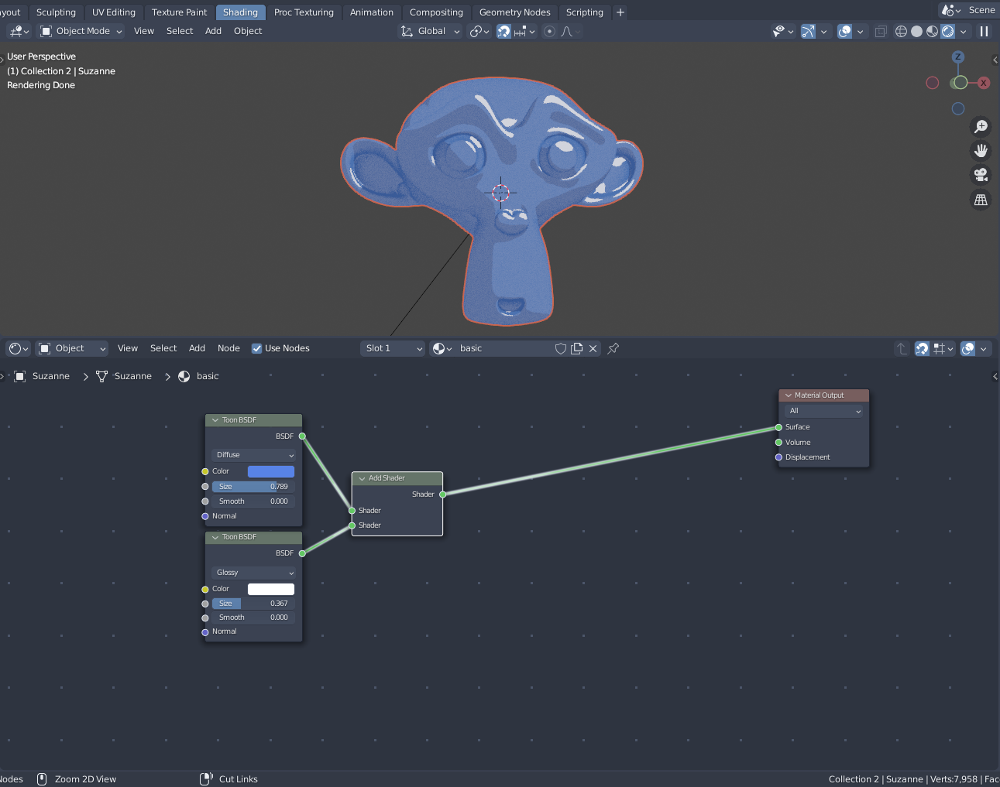

After creating a material you can remove the **Principled BSDF**, or just move it to the side and disconnect it from the **Material Output**, and replace it with a **Toon BSDF**  that is connected to the material output. 

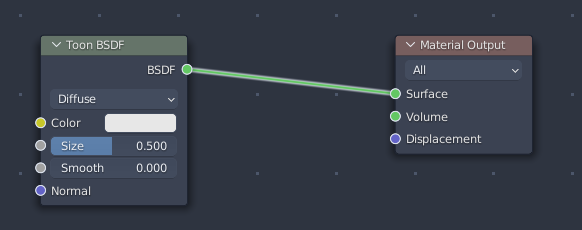

That's it, Thanks for reading!

just kidding 😁

To achieve a glossy look , i.e. ass specular highlights, duplicate the **Toon BSDF**, change the type from *Diffuse* to *Glossy* then add the two together with an **Add Shader Node**. One might think it would be better to use a **Mix Shader** however it doesn't work as well. Since the the output of the Glossy mode is black for the darkest values and light for the specular highlights the mix shader won't handle it as well where the add shader is added them together causing the dark parts to be discarded. 

There is a caveat however, when using any form of sky texture in the *World Environment* the dark parts will be reflections of the sky texture. This problem is easily avoided by not using a sky texture in the world environment but to instead of use a UVSphere as a sky texture with it's *Glossy, Diffuse, Transmission and Volume* ray visibility settings set to off. This is done under *Object Properties > Ray Visibility*   

The *Size* of both of the both **Toon BSDF** shader nodes will control the shading point cutoff and the *Color* of the **Glossy Toon BSDF** will control the brightness of the highlights.

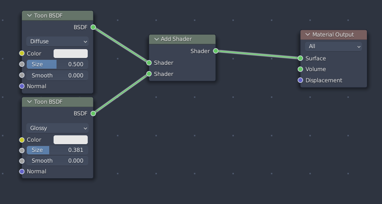

From here you can connect your color texture or vertex color to the *Color Input* of the **Diffuse Toon BSDF** as well as any sort of normal map or bump map to the *Normal inputs* using a **Normal Map** node or **Bump node**, respectively, which will control the look of the shading. For Example Use a **Noise Texture** Node to make the shading a little wobbly or a dither texture.

## Not so Basic Toon Shader

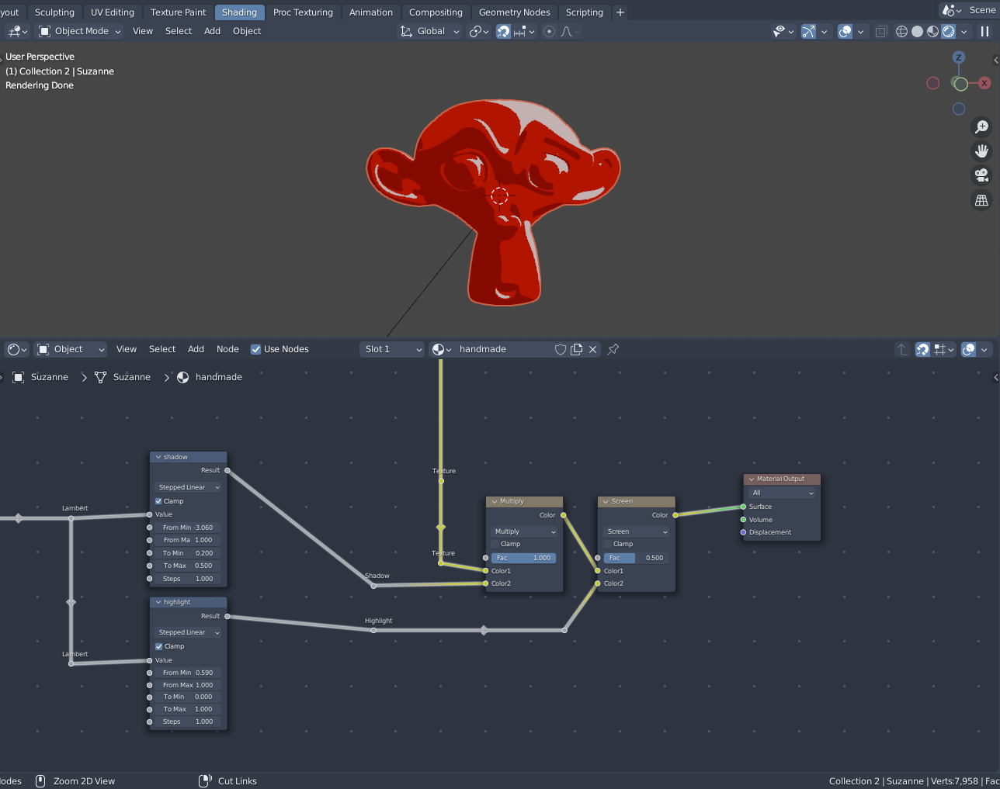

This method takes advantage of [lambert shading](https://en.wikipedia.org/wiki/Lambertian_reflectance) to achieve the toon effect. Annoyingly,  Blender doesn't allow you to acquire the light direction vector so this one is kind of a hack. This method uses a minor amount of vector math but don't worry it's not super complicated.

### Lambert Shading

1. Start by adding an **Empty Object** to your scene and rename it to "Toon Light Source" maybe even move it off to the side a little bit. I recommend a location of (1, -1, -1) "XZY".  

2. Back in the shader editor add a **Texture Coordinate node** and select the empty with the *"Object"* selector on the **Texture Coordinate node**. From here you will add two **Vector Math nodes** and set them both to *Normalize*, connect the *Generated slot* of the **Texture Coordinates Node** to the first *Normalize Vector Math node* and the *Object slot*  to the second **Normalize Vector Math node** .
	 
 	*Note:* The **Object Coordinates** are in world space so we use the **Normalize Vector Math Node** to remap it a length of 1.0 to ensure no problems are caused. This can be omitted if you want the light to falloff based on difference.

3. From the **Normalize Vector Math node** that is connected from the *Object Coordinate slot*  add a new **Vector Math node** and set it's mode to *Subtract* and have the output of the **Normalize** to the second slot of the subtract, set the top value of the **Subtract Vector Math node** to (1,1,1)  this is used to invert the input value. Alternatively you can use a **Color Invert Node**.

4. Connect both the **Subtract Vector Math node** and the **Normalize Vector Math node** to a new **Vector Math node** set to **Dot Product**

Since that's a lot to take in here's an image to demonstrate 

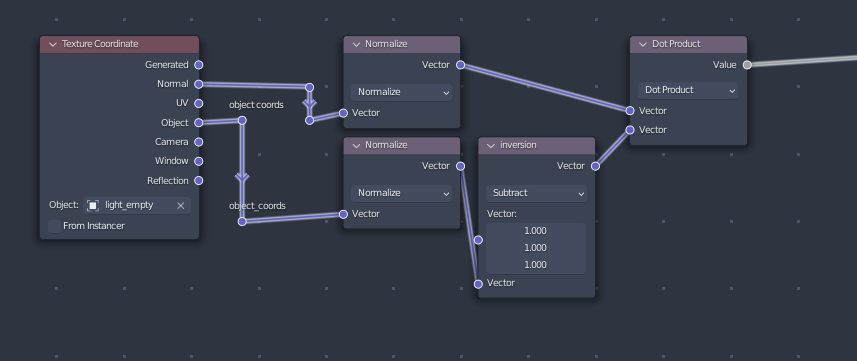

### Mapping the Output

This creates a basic Lambert shading that is quite useful, for example, you can use it as the Texture Coordinate to have a texture follow the shading point (i.e. using a 1px by 16px gradient created in external software or some sort of dithering texture), or you can use a [ColorRamp](https://docs.blender.org/manual/en/latest/render/shader_nodes/converter/color_ramp.html) to dictate which colors are used where by using the color stops. What we're going to use is something that gives you a lot more control than a Color Ramp, we're going to be using the [Map Range Node](https://docs.blender.org/manual/en/latest/render/shader_nodes/converter/map_range.html)

The Map Range node allows you to take an input value and map it onto another value. For example you can take an input of 0 to 1 and map it onto a range of 1 to 10 or -1 to 1. There are also a couple of Interpolation Methods of which control how the numbers are re-mapped. For toon shading we will to be using the *Stepped Linear* Method.

The benefit of using the *Stepped Linear* is that it gives us a *Steps* value. This value controls how many stops (or steps) there are between 0 and 1. For this tutorial we have it set as 1.0 so we have two tone shading however it can be adjusted by changing it to any whole number to achieve any number or steps. For example we can use 2.0 to get 3 tone shading or 3.0 to get 4 tone shading. Make sure to keep the *Clamp* Checkbox enabled to not cause any trouble. 

Unlike using a *Color Ramp*, we have far more fine tuned control over how the shading is mapped.

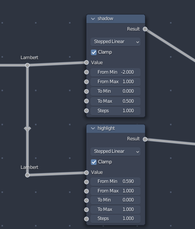

In this example image there are two *Map Range nodes*, one to control the **Shadow Size** and one to control the **Highlight Size**. In which the *From Min values* of each control and the *Ton Min values* control the brightness.

Finally we can add these values to create both of the lowlight and highlight shading.

### Adding Color

We're going to be doing this with [MixRGB Node](https://docs.blender.org/manual/en/latest/render/shader_nodes/color/mix.html)

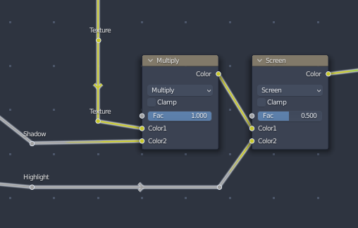

The **Multiply** node takes the **Texture** input, which can be your color texture, [RGB Color Node](https://docs.blender.org/manual/en/latest/render/shader_nodes/input/rgb.html) or vertex color, and **multiplies** it with the shadow. This connects to a **Screen** Mix RGB where the highlight connects as well. Both of which are connected to the **Material Ouput**.

This method isn't as robust as the basic toon shader because it only works on one "light source"(i.e. the empty but with some work can be used with more light sources) however it works in a pinch and is great if you only want one light source.

# Render Settings

Even though you got the toon shading worked out it still doesn't look great, the handmade toon shader looks good but the basic one doesn't. There are a few tricks I've learned over the years to fix this so lets go over them.

There is a basic setup that's needed in order to make cycles work with toon shading. First, you've got to change some things. 

## Max Bounces

Under the Blender *Render Setting Tab* there is a **Light Paths > Max Bounces** section. These values control how many bounces are being used with each ray being casted from the camera. The default values we see here are fine for Photorealism but we don't need that many bounces for toon shading especially because we aren't dealing with realistic lighting or reflections. 

The solution we will be using is effectively turning off the ray bounces. Some values in Blender treat zero as infinity or as inherit the parent value but luckily the **Total Bounces** will treat zero as zero instead of infinity and since we're doing toon shading we shouldn't need more than zero, one or  two depending on the scene and aesthetic.

Don't worry about the other bounces like *Diffuse* or *Glossy* because the *Total bounces* will clamp those values to a value of 0. The only value that ignores the max bounces is the *Transparent* one which is great because it allows us to retain transparency effects with lots of objects like grass or fog.

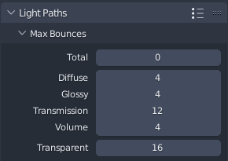

## Ambient Occlusion

This one is one that stumped me for a while, Even though you have your max bounces set to zero and you're using a **Toon BSDF** there is still a gradient falloff in shadow. This simply won't do when you're doing any sort of NPR. For this we're going to be utilizing **Global Ambient Occlusion**, but more specifically a quirk of it.

### What even is Ambient Occlusion?

*Ambient Occlusion* is the effect where shadows will accumulate in corners or where two objects or faces meet. 

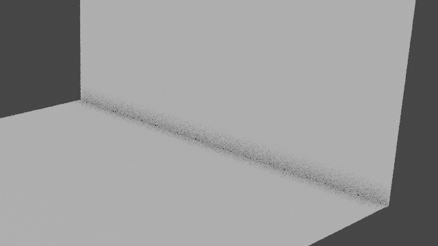

There is a quirk with ambient occlusion in cycles that allows us to dampen those weird gradients in shadows on our toon shaded renders.

Since **Ambient Occlusion** changed in Blender 3.0+ we're going to cover both

### Ambient Occlusion with Blender 3.0+

1. Under the *light paths* section in the *Render Settings tab* scroll down to ***Fast GI Approximation*** and click on the little checkbox to turn it on. 
2. Click on the little chevron next to it to expand it. In here we can adjust the AO settings 
3. Change the method from *Replace* to *Add* and then set the *distance* to a value of 0. 
4. From here we can adjust the *AO Factor* Slider to adjust the darkness of our shadows.

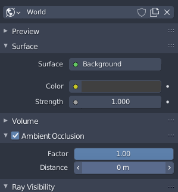

### Ambient Occlusion with Blender 2.8+

Blender 2.8+ is similar but different. Here, The *Ambient Occlusion* is hidden inside of the World Tab. 

Activate Ambient Occlusion by clicking on the *Checkbox* and expand it clicking on the arrow. We don't have to ability to change the mode but it works basically the same as the *Add* mode in Blender 3.x. Set the *Distance* to 0 and the *Factor* slider will control the darkness of our shadows.

# Using Denoising to Clean up 

Blender has added OpenImageDenoise which is a really powerful denoising tool that will help make our NPR renders, as well as Photoreal render, look super good. It will also help you speed up your renders by having to use less samples and cleanup the shading since shadows tend to be noisier. 

Personally, the max render samples I use on all renders ever since denoising was added is 8 samples. Some might say that you need 100's or thousands of samples to get the job done but luckily with NPR and toon shading and the introduction of OpenImageDenoise you don't really need that much.

## Noisy Image

Noisy Image with an AO Factor of 0.36 at 8 samples

## Denoised Image

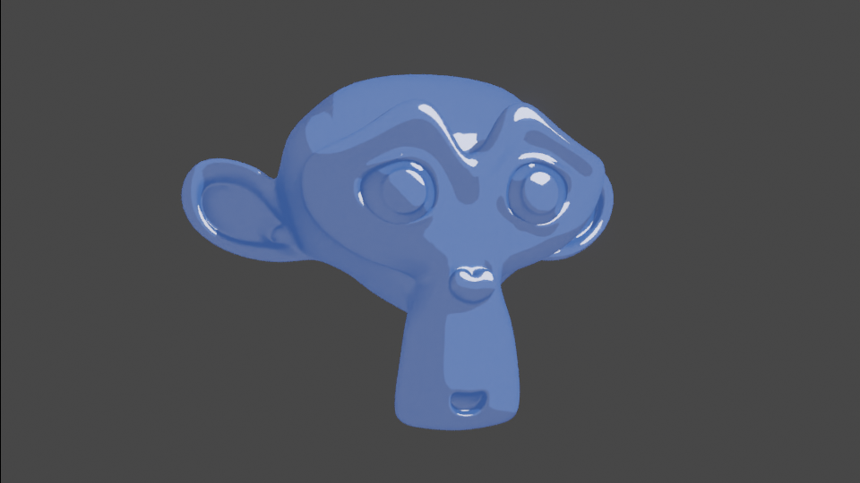

Denoise Image with an AO Factor 0.36 at 8 samples with Fast OpenImageDenoise

# In Conclusion

By using the things covered in this tutorial you can achieve pretty fancy looking toon shading inside of cycles. It might take a little work but hey, It's fun! You might wonder: "Why not just use eevee its way easier" and to that I say, sure, What ever toolset you want to use go for it! ~~And I'm stuck on cycles because I'm using an computer it takes 5 to 30 seconds for a eevee material to compile depending on complexity~~

At the end of the day, this isn't the 'End all Be all' of Toon Tutorials but these are the tricks that I've learned over the years before eevee was a thing.