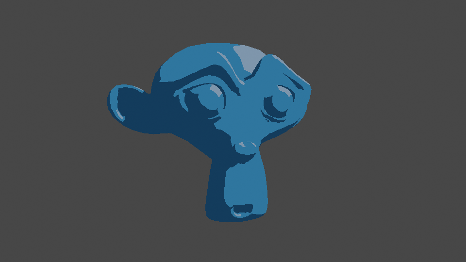
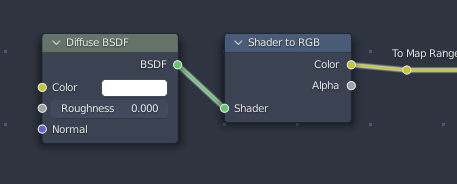
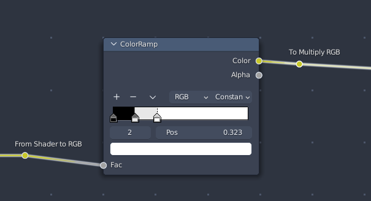
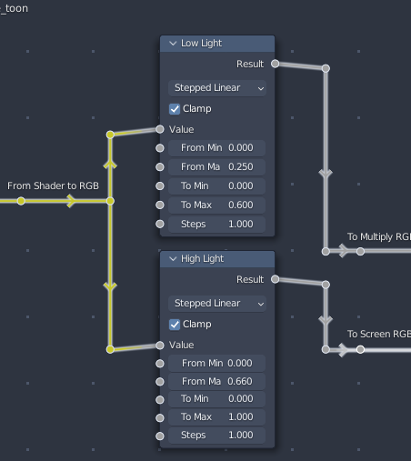
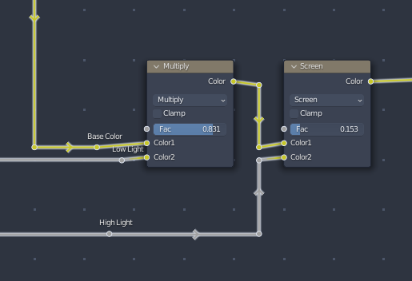
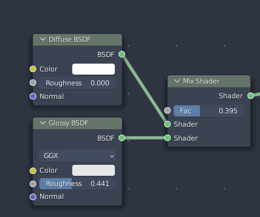

*In this tutorial we will be covering how to handle toon shading inside of the Eevee Render engine with Blender*

*~5 Minute Read*

# Directory

- [What is a 'Toon Shading'](#what_is_it)
- [The Materials](#material)
    - [Shader Nodes](#shader_nodes)
        - [Shader To RGB](#shader2rgb)
        - [Using a Color Ramp](#colorramp)
        - [Using the Map Range Node](#map_range)
        - [Adding it Together](#adding_together)
    - [Glossiness or very shiny materials](#gloss)
- [Conclusion](#conclusion)

# What even is a 'Toon Shading'

Toon Shading, Two Tone Shading or [Cel Shading](https://en.wikipedia.org/wiki/Cel_shading) (It has many names) is a shading technique used to to emulate the shading found in traditional animation like cartoons and anime. Considering how in traditional animation each frame is drawn by hand, realistic shading isn't possible on foreground elements like Characters that are animated every frame (or at least, would be extremely difficult and time consuming). Background elements can get away with having a little more realistic shading and rendering since they can be reused depending on the camera angle or context.

Unlike the methods covered in the Cycles Toon Shading Tutorial toon shading in eevee is much less convoluted.

# The Material

Once you've created a new material for your object, or an existing one, we can now remove the *Principled BSDF* node or just move it to the side and disconnect it from the material output. From here we can add a new **Diffuse BSDF Shader** from the *Add > Shader* menu and place it in the node tree. 

*Tip: You can have multiple material setups inside of the same node tree by having multiple Material Output Nodes. The Material Output node that is highlighted by selecting it and pressing Tab, denoted by the label of the node having color, is the active material output. You can also set which target render engine that material output will use. This is useful if you have want to have a toon shader for both eevee and cycles since toon shading is done differently in each engine*

Similar to the Not So basic material in the Cycles Toon Shading Tutorial, we're going to be getting the shading point of of the light source and use that to control the two tone shading. Instead of using Vector Math, Object Coordinates and Normal Coordinates we're going to be using a node that is exclusive to Eevee which is the **[Shader to RGB Node](https://docs.blender.org/manual/en/latest/render/shader_nodes/converter/shader_to_rgb.html)**. This Node will take the output of any shader and turn it in to a RGB value that can be manipulated with any *Color node, Converter Node or Vector Node* or be used as a Texture Coordinate itself.
 
 
 
# Shader Node Tree

## Using Shader to RGB

Connect the **[Diffuse BSDF Output](https://docs.blender.org/manual/en/latest/render/shader_nodes/shader/diffuse.html)** to the **Shader to RGB** Input and we've got our shading point. With this we can use it to control the texture coordinates of a texture, the gradient of a color ramp or multiply it with a color/texture. One might think it's a good idea to connect your Color Texture to the color input of the Diffuse BSDF but this won't work because the output of the Shader to RGB node will be used as the luminance values of our shading, essentially the colors of the input texture will be converted to grayscale and will affect our shading.

## Using a Color Ramp

One Method that is used to create a toon effect is to connect the output of the **Shader to RGB node** to a **[Color Ramp](https://docs.blender.org/manual/en/latest/render/shader_nodes/converter/color_ramp.html?highlight=color%20ramp)**, with the interpolation mode set  to *Constant interpolation* and manually create the shading stops with colors or shades. 

Where this technique can work wonders it has it's own limitations. For one, it makes it more difficult to wrap the nodes up into a group node because at the time there is no Color Ramp input widget for [Node Groups](https://docs.blender.org/manual/en/latest/render/shader_nodes/groups.html). Another limitation is that the color stops will all be bunched up on the left side of the gradient because the color values are way to high for the ramp to handle. However this can be fixed by using a Map Range between the Shader to RGB and the Color Ramp.

## Using The Map Range Node (My Preferred Method)

Since the output of the Shader to RGB node is just a Color value we can connect the input to a *Map Range node* and control the cutoff of  the shading. A benefit of this is that you have more fine tuned control over the shading cutoff and can be easily wrapped up into a group node since the inputs of a Map Range are numbers and don't rely on a specialized widget. 

Simply add a **[Map Range node](https://docs.blender.org/manual/en/latest/render/shader_nodes/converter/map_range.html)** to your Node Tree and connect the output of the **Shader to RGB node** to the *Value* Input of the **Map range node** and set the interpolation mode to **Stepped Linear**. The steps of the Stepped linear interpolation mode will control how many brightness steps there are or stops, for two tone shading we set the step value to 1.0, three tone shading a value of 2.0. The *From Min* and *From Max values* will control the shading cutoff.

Here we can see another Map Range node labeled as *High Light*. This is an optional node that is used to control the specular highlights of the shading.

## Adding it Together

From here, we can use **MixRGB** nodes to add color to our material. To add the lowlight shading to a texture create a **MixRGB** node and set it to **Multiply**, connect the **Map Range** output to the second *Color Input* of the **Multipy MixRGB** node and the Color Texture to the first *Color Input*. The *Factor slider* will control how dark the lowlight shading is.

Adding another **MixRGB** node after the **Multiply MixRGB** node we can bring in the highlights by connecting the *High Light Map Range* to the *Color2 Input* of the second **MixRGB** and set the mode to **Screen**.

And Finally you can connect the output of the **Screen MixRGB Node** to the Material Output's Surface Input or an Emission Shader that is connected to the Material Output. 

## Glossiness or very shiny materials

Sometimes you might need a shiny material that will change based on view and lighting, with eevee toon shading this is a lot easier than one might think. Simply mix a **Glossy BSDF** with the **Diffuse BSDF** at the beginning of the material chain with a **Mix Shader** or an **Add Shader** and you get those shiny materials.

If you use a Mix Shader you can control the brightness of the glossiness with the *factor slider*. If you use an Add Shader you can control the glossiness with the *Color* Value of the Glossy BSDF. The *Roughness* value of the Glossy BSDF works similar to the Roughness value of a Principled BSDF but with the Metallic value set to 1.0.

# Conclusion

These are the tricks that I've picked up over time with eevee and non photoreal shading, most of the time the color ramp approach is great because you can manually adjust the colors of each color stop for example if it's a warm evening scene the colors might have a warmer tone to them and you can create color stops with warmer tones. However the Map Range method will allow faster iteration especially if you wrap it inside of a group node.

